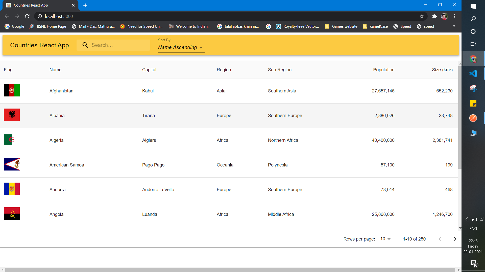
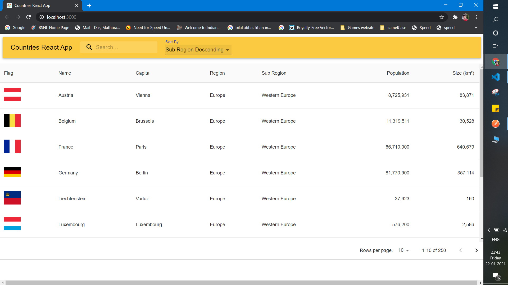

# REST-Countries-React-App

### A app build for analysing different countries datas
### To run the app locally go to client folder then npm install and then npm start
### Some of the technologies used were:
* React.js
* Redux
* Material UI
* Axios

